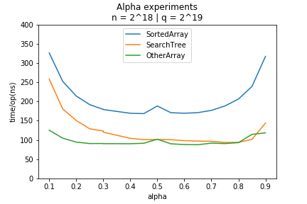

## Skewed Binary Search Trees

Implementations of three different versions of a binary search data structure with a balanced parameter of alpha between 0 and 1. The data structures is given a set S containing n distinct 32-bit integers. The datastructures contain a method Pred that when given an input x will return the largest integer y of the set S. The integer y should be smaller or equal to x.

1. SortedArray (SA): The elements of S are stored in a single, sorted array, and queries are solved using a Skewed binary search.
2. DFSr SearchTree (ST): Each node of the tree is represented as an object that holds an element of S and has up to two child nodes. The left subtree should have an alpha fraction of the nodes, and the right subtree should have the remaining 1 - alpha fraction.
3. PqDFS OtherArray (OA): The elements of S are stored in a single int array of length 3n that represents a skewed binary search tree. Each of the n nodes of the tree is stored in the array as three consecutive entries (left, key, right), where left and right are the array indices for where the left and right child nodes are stored in the array (or -1 if they don't exist), and
key is the element of S represented at this node.

Our  preliminary  hypothesis  was  that  a skewed binary searched tree would be faster in  practise  than  the  perfectly  balanced  binary search tree. The results of our experiments confirmed this hypothesis.To prove this hypothesis, we conducted three  different  experiments.  We  also  implemented  three  different  layouts:  a  sortedarray  (SA),  DFSr  search  tree  (ST),  and  a PqDFS other array (OA). First, we compared the  running  time  of  the  three  layouts  ondifferent alphas, then we ran an experiment on  various  blocking  sizes  p  for  the  PqDFS OA,  and  at  last,  we  ran  the  running  time for  the  three  layouts  with  alpha  based  onexperiment 1 and p based on experiment 2.

This figure shows the running time of the three different data structures on different levels of skewness (alpha).
* n is number of 32-bit integers contained in the data structures
* q is the number of queries processed

As expected a small amount of skewness enhances the running time of prediction.

## Rank-Select Data Structures

Implementations of three variants of rank-select datastructures:

1. RankSelectNaive: the naive data structure that uses an int[n] array of 0/1 values to
store the data and where queries may take up to O(n) time.
2. RankSelectLookup: a smarter data structure, where you in O(n) time precompute the
rank of all positions and store it in an int[n] array. Select queries should be answered
in O(log n) time by using a binary search on this rank array.
3. RankSelectSpaceEfficient: a more space-efficient data structure with a parameter k. It uses one array R. the entry Rs[i] is set to Rank(32ki) in a precomputation
step. Select queries are again implemented using a binary search on the rank.

We experimented on these three implementations. In theory, the naive one should
run the slowest for rank and select with a running time of O(n) and uses 32*bits
of memory. The rank method should run fastest for the RankSelectLookup with a
running time of O(1). The running time of the rank method for RankSelectSpace-
Efficient should run O(k) time, k being the number of blocks. In theory, both the
select method for RankSelectLookUp and RankSelectSpaceEffcient should run O(log
n) time, but given that RankSelectSpaceEfficient uses less bits of memory, we expect
RankSelectSpaceEffcient to run faster for very large n. Our hypothesis is that less
usage of memory space will eventually lead to better run time performance for very
large n.
